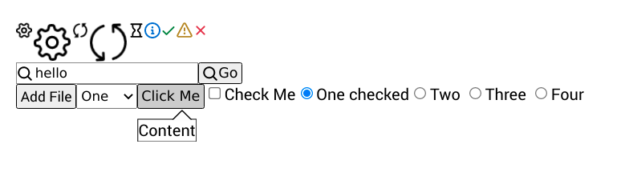

# solid-base-components

This is a collection of barely styled components on which you can build your own
design system. It tries to use more consistent patterns such as always provinding
the changed value to `onChange(value: any, ev: Event)` handlers of input elements.

Commonly used non-native elements are also implemented, such as popovers with arrow,
and more to come.




## Installation

```bash
npm install solid-base-components
```

## Usage

```javascript
import { render } from 'solid-js/dom'
import { Box, Input, InputFile, Select, Popover, Checkbox, Radio } from 'solid-base-components';

const App = () => <>
  <Box>
    <Input
      onChange={text => console.log(text)}
    />
    <InputFile>Add File</InputFile>
    <Select
      options={options}
      value={1}
      onChange={console.log}
    />
    <Popover
      arrow
      closeOnClick
      trigger={({ ref, open }) =>
        <Button ref={ref} onClick={toggle}}>
          Click Me
        </Button>
      }
    >
      <div>Content</div>
    </Popover>
    <Checkbox onChange={isChecked => console.log(isChecked)}>
      Check Me
    </Checkbox>
    <Radio.Group
      name='number'
      options={options}
      value={1}
      onChange={console.log}
    />
  </Box>
</>

render(() => App, document.getElementById('app'))
```

## Styling

You are expected to provide your own styles for components. They follow
a strict [BEM](http://getbem.com/) convention.

For example, to add button styles:

```javascript
<Button size='small' variant='primary'>
  Click Me
</Button>
```

```css
.Button {
  border: 2px solid black;
}
.Button--small {
  color: white;
  background-color: blue;
}
.Button--primary {
  color: white;
  background-color: blue;
}
```
