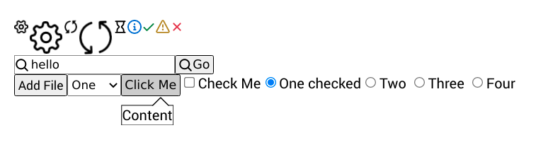
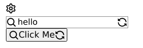

# solid-base-components

This is a collection of barely styled components on which you can build your own
design system. It tries to use more consistent patterns for all input elements
to make development easier.

Commonly used non-native elements are also implemented, such as popovers with arrow,
and more to come.




## Installation

```bash
npm install solid-base-components
```

## Usage

```javascript
import { render } from 'solid-js/dom'
import { Box, Input, InputFile, Select, Popover, Checkbox, Radio } from 'solid-base-components';
// Minimally required layout styles
import 'solid-base-components/dist/build.css'

const App = () => <>
  <Box>
    <Input
      onChange={text => console.log(text)}
    />
    <InputFile>Add File</InputFile>
    <Select
      options={options}
      value={1}
      onChange={console.log}
    />
    <Popover
      arrow
      closeOnClick
      trigger={({ ref, open }) =>
        <Button ref={ref} onClick={toggle}}>
          Click Me
        </Button>
      }
    >
      <div>Content</div>
    </Popover>
    <Checkbox onChange={isChecked => console.log(isChecked)}>
      Check Me
    </Checkbox>
    <Radio.Group
      name='number'
      options={options}
      value={1}
      onChange={console.log}
    />
  </Box>
</>

render(() => App, document.getElementById('app'))
```

## Styling

You are expected to provide your own styles for components. They follow
a strict [BEM](http://getbem.com/) convention.

For example, to add button styles:

```javascript
<Button size='small' variant='primary'>
  Click Me
</Button>
```

```css
.Button {
  border: 2px solid black;
}
.Button--small {
  color: white;
  background-color: blue;
}
.Button--primary {
  color: white;
  background-color: blue;
}
```

## Icons

Icons use octicons for now. You can use them directly or on input/buttons:

```javascript
<Icon name='gear' />
<Input icon='search' iconAfter='sync' />
<Button icon='search' iconAfter='sync'>Click Me</Button>
```



`<Icon />` also takes props `info`, `success`, `warning` or `danger` for colors.

## Conventions

Elements try to follow these conventions:
 - Have an `onChange(value: any, ev: Event)` handler, where the first argument
    is the new value.
 - If `props.value` didn't change, keep the value in sync with the dom, to bring
     the behavior closer to React.
 - Have a `loading: boolean` property that sets the element to `disabled` and
     displays a spinning loading icon.
